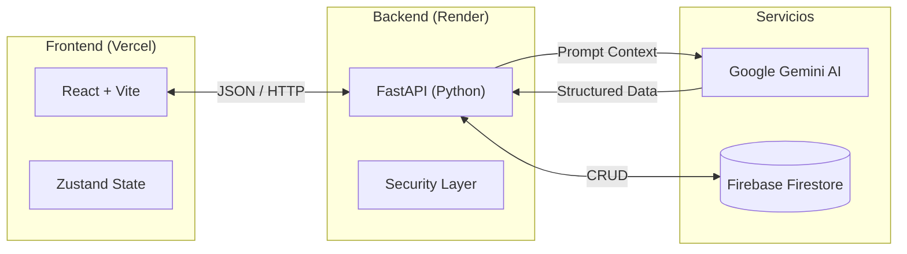

# 🛡️ ForgeVault v1.0

> **Sistema Integral de Gestión Personal (Finanzas & Bio-métricas) potenciado por IA.**


## 📖 Descripción
**ForgeVault** es una aplicación diseñada para eliminar la fricción en el registro de datos personales. Utiliza **Google Gemini 3 Pro** para transformar lenguaje natural ("Me comí un pan", "Gasté 5 lucas") en datos estructurados, permitiendo un seguimiento riguroso de:
1.  **Finanzas:** Control de presupuesto, "Burn Rate" diario y detección de gastos hormiga.
2.  **Salud:** Conteo de macros pesimista (Definición) y seguimiento de grasa corporal.

---

## 🏗️ Arquitectura del Sistema

El sistema utiliza una arquitectura **Client-Server** moderna con procesamiento de IA asíncrono.


---

## 📚 Documentación Técnica (Docs)

Toda la ingeniería del proyecto está documentada detalladamente en la carpeta `/docs`.

| Documento | Descripción | Nivel |
| :--- | :--- | :--- |
| 📄 [**Requerimientos**](./docs/REQUIREMENTS.md) | Definición funcional y alcance del MVP. | Negocio |
| 👤 [**Casos de Uso**](./docs/USE_CASES.md) | Flujos de usuario (Happy Path & Errores). | UX/Funcional |
| 🧠 [**Flujo de IA**](./docs/AI_WORKFLOW.md) | Diagrama de validación y procesamiento de Prompts. | Lógica |
| 🤖 [**System Prompts**](./docs/PROMPTS.md) | **El Cerebro.** Instrucciones y Schemas JSON de Gemini. | Backend |
| 🗄️ [**Base de Datos**](./docs/DB_SCHEMA.md) | Diagrama ER y Diccionario de Datos (Firestore). | Datos |
| 🏗️ [**Arquitectura**](./docs/SYSTEM_ARCH.md) | Mapa detallado de componentes y tecnologías. | DevOps |

---

## 🛠️ Stack Tecnológico

* **Frontend:** React (Vite), TailwindCSS, ShadCN UI, Zustand.
* **Backend:** Python 3.11, FastAPI, Pydantic.
* **Database:** Google Firebase Firestore (NoSQL).
* **AI Core:** Google Gemini 3 flash (AI Studio).

---

## 🚀 Instalación y Despliegue (Local)

### Pre-requisitos
* Node.js v18+
* Python 3.10+
* Cuenta de Google Cloud (Firebase & Gemini API Key)

### 1. Backend
```bash
cd backend
python -m venv venv
source venv/bin/activate  # En Windows: venv\Scripts\activate
pip install -r requirements.txt
uvicorn main:app --reload
```

### 2. Frontend
```bash
cd frontend
npm install
npm run dev
```

---

## 🔐 Seguridad y Autenticación

El proyecto utiliza **Firebase Authentication** para el manejo de usuarios. El backend implementa un sistema de **Refresh Tokens** para mantener la sesión activa sin exponer claves de API en el cliente.


---

## 📅 Estado del Proyecto
* [x] Fase 1: Arquitectura y Diseño
* [ ] Fase 2: Backend Core & Conexión AI
* [ ] Fase 3: Frontend & Integración

*Desarrollado con ❤️ para la optimización del tiempo y la salud.*

