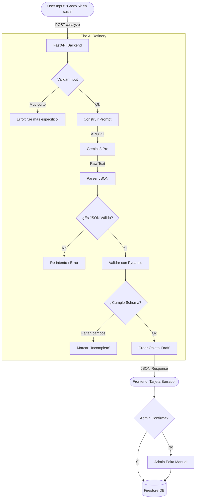

# Flujo de Inteligencia Artificial (AI Pipeline)

```mermaid
flowchart TD
    A([User Input: 'Gasto 5k en sushi']) -->|POST /analyze| B[FastAPI Backend]
    
    subgraph "The AI Refinery"
    B --> C{Validar Input}
    C -- Muy corto --> D[Error: 'Sé más específico']
    C -- Ok --> E[Construir Prompt]
    E -->|API Call| F[Gemini 3 Pro]
    F -->|Raw Text| G[Parser JSON]
    
    G --> H{¿Es JSON Válido?}
    H -- No --> I[Re-intento / Error]
    H -- Sí --> J[Validar con Pydantic]
    
    J --> K{¿Cumple Schema?}
    K -- Faltan campos --> L[Marcar: 'Incompleto']
    K -- Ok --> M[Crear Objeto 'Draft']
    end
    
    M -->|JSON Response| N([Frontend: Tarjeta Borrador])
    N --> O{Admin Confirma?}
    O -- Sí --> P[(Firestore DB)]
    O -- No --> Q[Admin Edita Manual]
    Q --> P
```