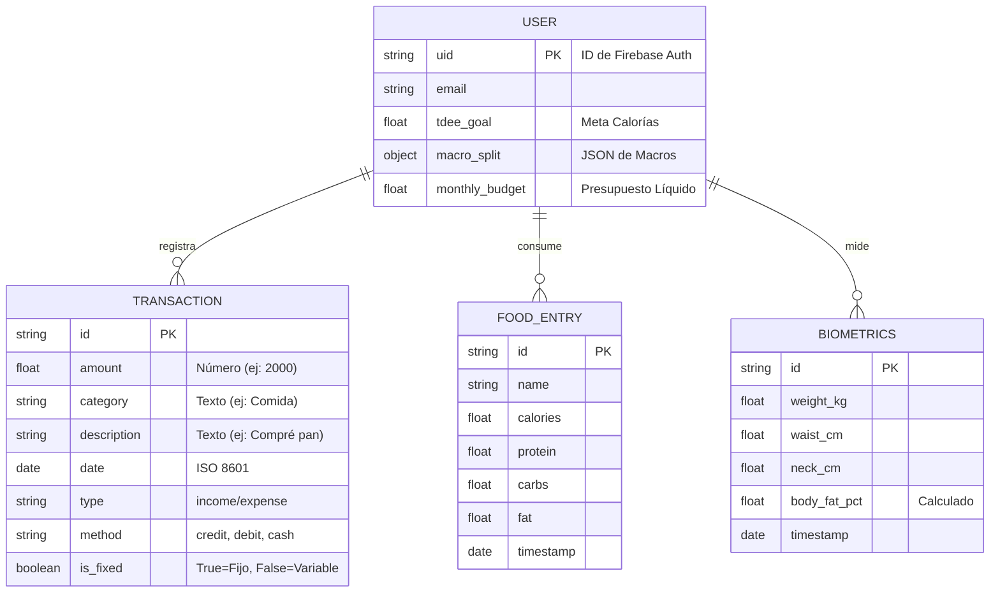

# Esquema de Base de Datos (NoSQL)

```mermaid
erDiagram
    USER ||--o{ TRANSACTION : "registra"
    USER ||--o{ FOOD_ENTRY : "consume"
    USER ||--o{ BIOMETRICS : "mide"
    
    USER {
        string uid PK "ID de Firebase Auth"
        string email
        float tdee_goal "Meta Calorías"
        object macro_split "JSON de Macros"
        float monthly_budget "Presupuesto Líquido"
    }

    TRANSACTION {
        string id PK
        float amount "Número (ej: 2000)"
        string category "Texto (ej: Comida)"
        string description "Texto (ej: Compré pan)"
        date date "ISO 8601"
        string type "income/expense"
        string method "credit, debit, cash"
        boolean is_fixed "True=Fijo, False=Variable"
    }

    FOOD_ENTRY {
        string id PK
        string name
        float calories
        float protein
        float carbs
        float fat
        date timestamp
    }

    BIOMETRICS {
        string id PK
        float weight_kg
        float waist_cm
        float neck_cm
        float body_fat_pct "Calculado"
        date timestamp
    }
```