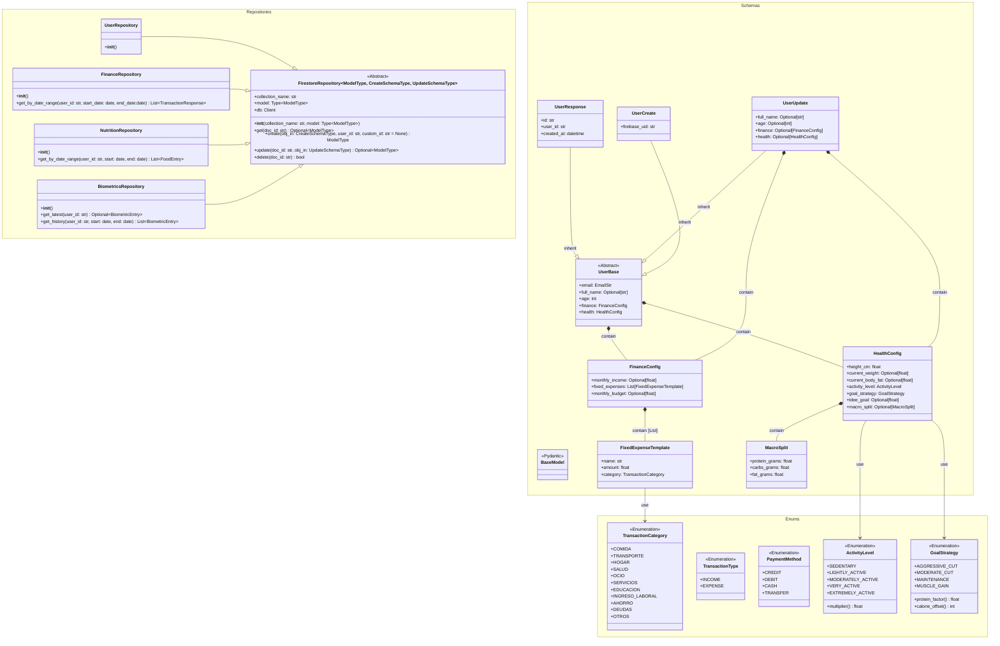

```mermaid
classDiagram
    namespace Enums{
        class TransactionCategory{
            <<Enumeration>>
            +COMIDA
            +TRANSPORTE
            +HOGAR
            +SALUD
            +OCIO
            +SERVICIOS
            +EDUCACION
            +INGRESO_LABORAL
            +AHORRO
            +DEUDAS
            +OTROS
        }
        class TransactionType{
            <<Enumeration>>
            +INCOME
            +EXPENSE
        }
        class PaymentMethod{
            <<Enumeration>>
            +CREDIT
            +DEBIT
            +CASH
            +TRANSFER
        }
        class ActivityLevel{
            <<Enumeration>>
            +SEDENTARY
            +LIGHTLY_ACTIVE
            +MODERATELY_ACTIVE
            +VERY_ACTIVE
            +EXTREMELY_ACTIVE
            +multiplier() float
        }
        class GoalStrategy{
            <<Enumeration>>
            +AGGRESSIVE_CUT
            +MODERATE_CUT
            +MAINTENANCE
            +MUSCLE_GAIN
            +protein_factor() float
            +calorie_offset() int
        }
    }
    namespace Repositories{
        class BaseModel {
            <<Pydantic>>
        }
        class FirestoreRepository~ModelType, CreateSchemaType, UpdateSchemaType~ {
            <<Abstract>>
            +collection_name: str
            +model: Type~ModelType~
            +db: Client
            +__init__(collection_name: str, model: Type~ModelType~)
            +get(doc_id: str) Optional~ModelType~
            +create(obj_in: CreateSchemaType, user_id: str, custom_id: str = None) ModelType
            +update(doc_id: str, obj_in: UpdateSchemaType) Optional~ModelType~
            +delete(doc_id: str) bool
        }
        class UserRepository {
            +__init__()
        }
        class FinanceRepository {
            +__init__()
            +get_by_date_range(user_id: str, start_date: date, end_date:date) List~TransactionResponse~
        }
        class NutritionRepository {
            +__init__()
            +get_by_date_range(user_id: str, start: date, end: date) List~FoodEntry~
        }
        class BiometricsRepository {
            +__init__()
            +get_latest(user_id: str) Optional~BiometricEntry~
            +get_history(user_id: str, start: date, end: date) List~BiometricEntry~
        }
    }
    UserRepository --|> FirestoreRepository : <UserResponse, UserCreate, UserUpdate>
    FinanceRepository --|> FirestoreRepository : <TransactionResponse, TransactionCreate, TransactionUpdate>
    NutritionRepository --|> FirestoreRepository : <FoodEntryResponse, FoodEntryCreate, FoodEntryUpdate>
    BiometricsRepository --|> FirestoreRepository : <BiometricEntryResponse, BiometricEntryCreate, BiometricEntryUpdate>
    namespace Schemas{
        class BaseModel {
            <<Pydantic>>
        }
        class FixedExpenseTemplate {
            +name: str
            +amount: float
            +category: TransactionCategory
        }
        class MacroSplit {
            +protein_grams: float
            +carbs_grams: float
            +fat_grams: float
        }
        class FinanceConfig {
            +monthly_income: Optional[float]
            +fixed_expenses: List[FixedExpenseTemplate]
            +monthly_budget: Optional[float]
        }
        class HealthConfig {
            +height_cm: float
            +current_weight: Optional[float]
            +current_body_fat: Optional[float]
            +activity_level: ActivityLevel
            +goal_strategy: GoalStrategy
            +tdee_goal: Optional[float]
            +macro_split: Optional[MacroSplit]
        }
        class UserBase {
            <<Abstract>>
            +email: EmailStr
            +full_name: Optional[str]
            +age: int
            +finance: FinanceConfig
            +health: HealthConfig
        }
        class UserCreate {
            +firebase_uid: str
        }
        class UserUpdate {
            +full_name: Optional[str]
            +age: Optional[int]
            +finance: Optional[FinanceConfig]
            +health: Optional[HealthConfig]
        }
        class UserResponse {
            +id: str
            +user_id: str
            +created_at: datetime
        }
    }
    UserResponse --|> UserBase: inherit
    UserUpdate --|> UserBase: inherit
    UserCreate --|> UserBase: inherit
    FixedExpenseTemplate --> TransactionCategory: use
    FinanceConfig *-- FixedExpenseTemplate: contain [List]
    HealthConfig *-- MacroSplit: contain
    HealthConfig --> ActivityLevel: use
    HealthConfig --> GoalStrategy: use
    UserBase *-- FinanceConfig: contain
    UserBase *-- HealthConfig: contain
    UserUpdate *-- FinanceConfig: contain
    UserUpdate *-- HealthConfig: contain
    

```