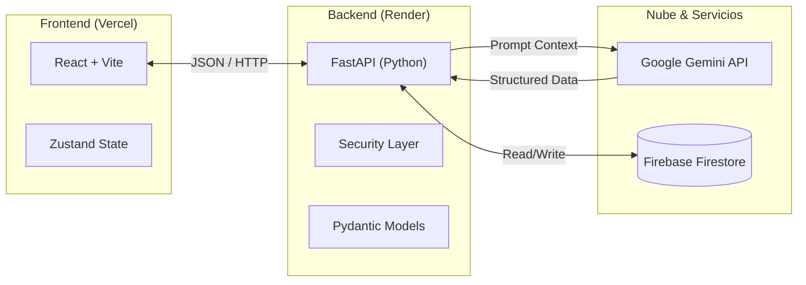

# Arquitectura del Sistema

Mapa de componentes de **ForgeVault v1.0**.

```mermaid
graph LR
    subgraph Client ["Frontend (Vercel)"]
        UI["React + Vite"]
        Store["Zustand State"]
    end

    subgraph Server ["Backend (Render)"]
        API["FastAPI (Python)"]
        Auth["Security Layer"]
        Schemas["Pydantic Models"]
    end

    subgraph External ["Nube & Servicios"]
        Gemini["Google Gemini API"]
        DB[("Firebase Firestore")]
    end

    UI <-->|"JSON / HTTP"| API
    API -->|"Prompt Context"| Gemini
    Gemini -->|"Structured Data"| API
    API <-->|"Read/Write"| DB
```